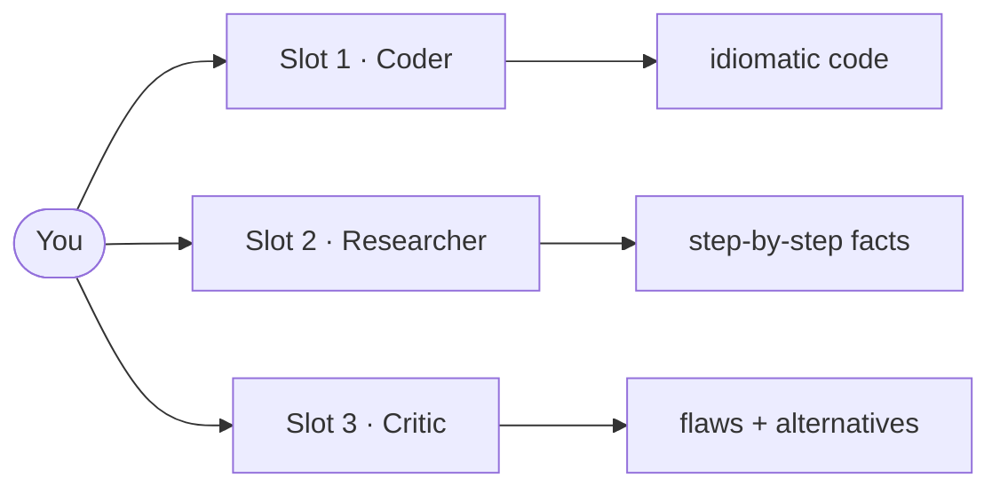
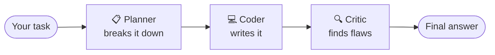
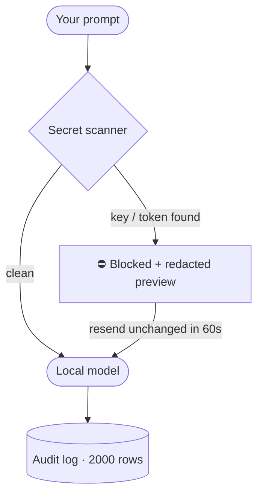

<div align="center">

# 🧪 ML Laboratory

### The local-first, security-hardened LLM workbench

**Chat with many models at once. Give each one a job. Broadcast, compare, and relay — all against your own Ollama server. Your prompts never leave your machine.**

[](LICENSES/AGPL-3.0.txt)
[](LICENSE-COMMERCIAL.md)
[](https://www.rust-lang.org)
[](https://ollama.com)
[](#-system-requirements)

</div>

---

## ✨ Why ML Lab?

Most AI tools give you **one model, one chat box, and a cloud bill**. ML Lab flips that:

| | Cloud chatbots | ML Lab |
|---|---|---|
| Models per session | 1 | **Many, side by side** |
| Roles | none | **Coder, Researcher, Critic, Planner, Writer…** |
| Ask every model at once | ❌ | **✅ Ask-all broadcast** |
| Models build on each other's answers | ❌ | **✅ Relay pipeline (roadmap)** |
| Your data leaves your PC | ✅ always | **❌ never — loopback by default** |
| Secret-leak protection | ❌ | **✅ outbound scanner + audit trail** |
| Works offline | ❌ | **✅ 100% local** |
| Price | subscription | **free (AGPL) or commercial license** |

---

## 🖥️ Tour

### 💬 Chat — model slots with jobs

Give every slot a **model** and a **role**. Each role ships a tuned system prompt:



> **Ask all** fires one prompt at every slot in parallel.
> **Compare view** lays the latest answer from each slot side by side.

### 🔁 Relay — models working together *(in build)*

Instead of racing, models collaborate **sequentially** — each one improving on the last. Sequential also means one inference at a time, so a modest machine punches above its weight:



### 🧠 Neural profiler — learns how you work

Every completed turn trains a tiny on-device network (chat latency, outcome, role, model) and plots the loss curve. No telemetry, no cloud — the `network.bin` lives in your data dir.

### 🛡️ Security first



- **Outbound secret scanner** on every AI-bound path (chat, broadcast, editor-assist): known prefixes + entropy tripwire
- **Loopback-only Ollama URL** by default; LAN servers need an explicit toggle
- **Audit trail** of model assign/pull/delete, stops, broadcasts, secret blocks — newest-first in History

### 📝 Plus

- **AI code editor** with diff review, syntax highlight, Send-to-Chat / Chat-to-Editor handoff, file Save/Open
- **Voice in/out** — mic dictation + read-aloud (local `piper` + `whisper-cli`, zero cost)
- **History** with search, rename, markdown export (per-slot or all-slots)
- **Keyboard-first**: `Ctrl+=/-/0` zoom · `Alt+1/2/3` or `F1–F3` focus slot · `F4` cycle · `Ctrl+Enter` ask-all

---

## 🚀 Quickstart

### 1. Install Ollama

| OS | Install |
|---|---|
| Linux | `curl -fsSL https://ollama.com/install.sh \| sh` |
| macOS | `brew install ollama` or [ollama.com/download](https://ollama.com/download) |
| Windows | [ollama.com/download](https://ollama.com/download) |

Pull at least one model:

```bash
ollama pull llama3.2:1b   # small & fast — great first model
ollama serve              # serves at http://localhost:11434
```

### 2. Build & run ML Lab

```bash
git clone https://github.com/basweegen/ML-Labrotory.git
cd ML-Labrotory
cargo run --release
```

The release binary is ~14 MB. First run drops a validated desktop launcher at `~/.local/share/applications/ml-lab.desktop` (Linux).

---

## 💻 System requirements

> Written for **any** machine — not just the one it was born on. Tested on Linux; macOS and Windows work through the same Rust + Ollama stack.

| | Minimum | Comfortable |
|---|---|---|
| **OS** | Linux (tested), macOS 13+, or Windows 10+ | same |
| **Rust** | 1.85+ (build only) | latest stable |
| **Ollama** | running at `http://localhost:11434` | same |
| **RAM** | 8 GB — stick to ~1B models | 16 GB+ — 3–4B+ models fly |
| **Disk** | 100 MB app + room for models (1–5 GB each) | SSD with 20 GB free |
| **GPU** | not required (CPU inference works) | any Ollama-supported GPU speeds it up |

ML Lab reads your real RAM budget live and tells you what fits:

| Badge | Meaning |
|---|---|
| 🟢 LOW | stick to ~1B models |
| 🟡 MEDIUM | 1–3B models fit |
| 🟠 GOOD | 3–4B models fit |
| 🔴 HIGH | 4B+ models fit |

A **15% RAM reserve is always held back for the OS** — slot assignment, new slots, and model picks are all gated by real headroom, so a small box stays at 1 slot while a server can grow toward dozens.

---

## 🗺️ Roadmap

- [x] Multi-slot chat with roles, streaming, stop/retry
- [x] Ask-all broadcast + Compare view
- [x] Secret guard, loopback lock, audit trail
- [x] Neural profiler, voice, history, editor handoff
- [ ] **Relay pipeline** — sequential model collaboration *(in build)*
- [ ] Relay progress UI + answer synthesis pass
- [ ] Saved relay templates (Plan → Code → Critic)
- [ ] UI polish pass + light-theme contrast

---

## 📄 Licensing (dual-license)

Pick one:

1. **Community — AGPL-3.0-or-later** (`LICENSES/AGPL-3.0.txt`). Free for personal, educational, and research use. Run a modified copy on a server or embed it anywhere and you must publish your source.
2. **Commercial** (`LICENSE-COMMERCIAL.md`). For companies that want to run, modify, or embed ML Lab without copyleft obligations. Contact the copyright holder to purchase.

Copyright (C) 2026 Sean M. Stow.
